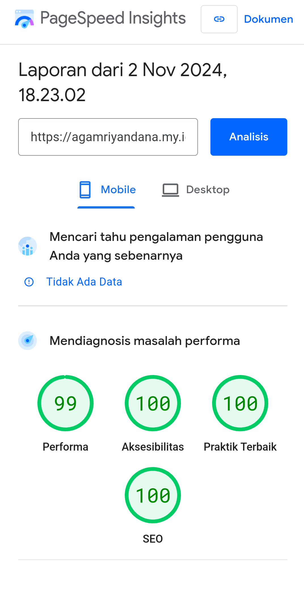

# Website Biolink
give me a treat
https://trakteer.id/agam1/tip

In today's social media era, grabbing the attention of internet users is a big challenge, especially if our website is slow. Therefore, the Biolink Community Website template prioritizes loading speed as its main focus. Without sacrificing design and features, this template offers simplicity that is even superior to my previous template. The proof?

## Authors

- [@realagam1](https://www.instagram.com/realagam1/)

## Demo
1. Feature : profile using link or to local 

2. Feature : Link Button

3. Feature  : Social Media Buttons

4. Feature  : Open Graph

## Demo

https://agamriyandana.my.id

## PageSpeed 

